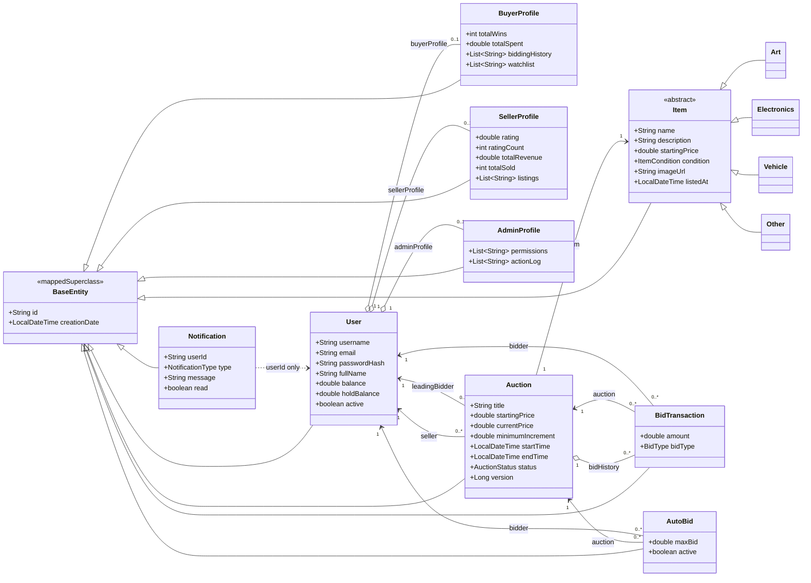
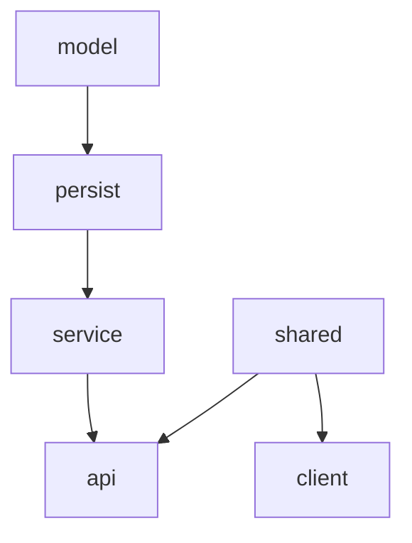

# CS2043-Capstone-Project

## Mô tả bài toán và phạm vi hệ thống

Hệ thống là một nền tảng đấu giá trực tuyến full-stack, thời gian thực, cho phép nhiều người dùng cạnh tranh mua sản phẩm trong một khoảng thời gian xác định. Khác với thương mại giá cố định, giá cuối cùng được quyết định thông qua quá trình đặt giá cạnh tranh giữa các bidder đã đăng ký.

Phạm vi triển khai bao gồm:
- Quản lý người dùng với phân quyền theo vai trò (Buyer, Seller, Admin)
- Quản lý vòng đời phiên đấu giá: tạo → kích hoạt → đặt giá → đóng/huỷ
- Cập nhật thời gian thực qua WebSocket (STOMP over SockJS)
- Đặt giá an toàn với optimistic locking và cơ chế giữ tiền (fund reservation)
- Các tính năng nâng cao: chống snipe, tự động đặt giá (auto-bid), tìm kiếm & phân trang, lưu trữ ảnh với MinIO
- Giao diện desktop JavaFX cho cả người dùng thông thường và quản trị viên

## Class Diagram



## Tech Stack

| Layer | Technology | Rationale |
|---|---|---|
| Language | Java 21 | LTS release with virtual threads (Project Loom) |
| Server framework | Spring Boot 3.2 | Convention over configuration, extensive ecosystem |
| Security | Spring Security (session-based) | Stateful HTTP sessions; simpler than JWT for a desktop client |
| Persistence | Spring Data JPA + Hibernate + PostgreSQL 16 | Full ORM with HQL/JPQL, migrations-free for prototyping |
| Object storage | MinIO (S3-compatible) | Self-hosted, avoids cloud vendor lock-in |
| Real-time | Spring WebSocket + STOMP | First-class support in Spring; SockJS fallback |
| Build | Maven (multi-module) | Mature, IDE-agnostic, fine-grained module dependency control |
| Client UI | JavaFX 21 + AtlantaFX | Rich desktop controls; AtlantaFX provides modern styling |
| DTO mapping | MapStruct 1.6 | Compile-time, zero-reflection mapping |
| Test | JUnit 5 + Mockito + Spring Boot Test | Standard Java testing stack |
| Coverage | JaCoCo | Line/branch coverage reports on every `verify` |
| Style | Google Checkstyle | Enforced at `validate` phase |

Yêu cầu cài đặt trước khi chạy:
- Java 21 (khuyến nghị dùng Eclipse Temurin 21)
- Apache Maven 3.9+
- Docker & Docker Compose (để chạy PostgreSQL + MinIO)

Kiểm tra phiên bản trên terminal (Linux/macOS/Windows):

    java -version
    mvn -version
    docker --version
    docker compose version

## Cấu trúc các module chính

Dự án sử dụng Maven multi-module, tổ chức theo thứ tự phụ thuộc từ dưới lên:

```
CS2043-Capstone-Project/
└── auction-system/
    ├── pom.xml                  ← Parent POM
    ├── docker-compose.yml       ← PostgreSQL + MinIO
    ├── shared/                  ← DTOs dùng chung (request/response records)
    ├── model/                   ← JPA entities (Auction, User, Item, ...)
    ├── persist/                 ← Spring Data repositories
    ├── service/                 ← Business logic (BidService, AuctionService, ...)
    ├── api/                     ← Spring Boot REST API + WebSocket
    └── client/                  ← JavaFX desktop application
```
**Dependency**:



## Commands

**Step 1**: Clone dự án:

    git clone https://github.com/TamTamCatWorks/CS2043-Capstone-Project.git
    cd CS2043-Capstone-Project/auction-system

**Step 2**: Khởi động PostgreSQL và MinIO bằng Docker Compose:

    docker compose up -d

Kiểm tra container đã chạy:

        docker compose ps

**Step 3**: Build toàn bộ dự án:

    # Linux / macOS
    mvn clean package -DskipTests

    # Windows (PowerShell hoặc Command Prompt)
    mvn clean package "-DskipTests"

**Step 4**: Chạy Server (API):

    mvn -pl api spring-boot:run

**Step 5**: Chạy Client (JavaFX):

    mvn -pl client javafx:run

**Step 6**: Run the seed script

    psql -h localhost -U postgres -d tamtamcatworks -f seed-dataset.sql

**Clean up**: 
Để tắt Docker sau khi dùng xong: 

    docker compose down

Nếu muốn xoá luôn dữ liệu (database + ảnh MinIO):

    docker compose down -v


6. Danh sách chức năng đã hoàn thành

| Feature | Module / Area | Status | Notes |
|---|---:|:---:|---|
| User Management | User/Item Management | Completed | Role-based (Buyer, Seller, Admin) |
| Auction Item Management | User/Item Management | Completed | Item CRUD, image storage support |
| Bidding | Auction Functionalities | Completed | Optimistic locking & fund reservation |
| Auction Closure & Management | Auction Functionalities | Completed | Spring Scheduler-based lifecycle |
| Global Exception Handling | API / Backend | Completed | @RestControllerAdvice |
| GUI (JavaFX + AtlantaFX) | Client | Completed | Desktop UI for users & admins |
| Concurrent Bidding Handling | Concurrency | Completed | Thread-safe bid processing |
| Realtime Updates (WebSocket/STOMP) | Realtime | Completed | STOMP over SockJS updates |
| Admin Panel | Further Functionalities | Completed | Admin controls implemented |
| Anti-sniping | Further Functionalities | Completed | Auction extension / protection |
| Auto-bidding | Further Functionalities | Completed | Automatic proxy bids |
| Bid History Visualization | Client / UI | Completed | Line chart of bid history |
| Search & Pagination | API / Client | Completed | Item search and paged results |
| Object Storage (MinIO) | Infrastructure | Completed | Auction images stored in MinIO |


7. Link báo cáo PDF và video demo

    - Link báo cáo PDF:
        https://github.com/TamTamCatWorks/CS2043-Capstone-Project/blob/main/docs/docs.pdf

    - Link video demo:
        https://drive.google.com/drive/folders/1X-gnQJJQ-8LMUYonsePNU4ffjVp54QlD
